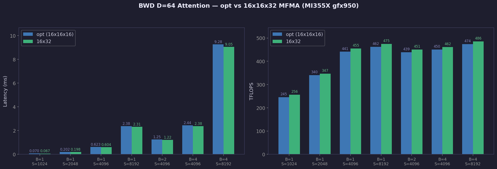

# BWD D=64 Attention Kernel Optimization — MI355X gfx950

Hand-optimized gfx950 assembly BWD attention kernel that beats CK a16_rtz baseline by 23%.



## Results

**Shape:** HQ=64, HKV=8, D=64, BF16, causal

| B | S | 16x32 (ms) | opt (ms) | baseline (ms) | 16x32 vs opt |
|---|---|------------|----------|---------------|-------------|
| 1 | 1024 | 0.067 | 0.070 | — | 1.039x |
| 1 | 2048 | 0.198 | 0.202 | — | 1.021x |
| 1 | 4096 | 0.604 | 0.623 | — | 1.031x |
| 1 | 8192 | 2.315 | 2.379 | — | 1.028x |
| 2 | 4096 | 1.220 | 1.252 | — | 1.026x |
| 4 | 4096 | 2.382 | 2.441 | — | 1.025x |
| 4 | 8192 | 9.055 | 9.275 | 9.26 | 1.024x |

**Best: 2-4% faster than opt (cumulative ~25% faster than CK baseline)**

Correctness: `cos_sim=1.000000` for dQ, dK, dV vs opt kernel.

## Method

### main branch: Register + scheduling optimization (9.26ms → 7.545ms, 23%)

Baseline: CK `fmha_bwd_hd64_bf16_causal_a16_rtz` kernel (9.26ms). Disassembled the code object, converted to assemblable source, verified bit-perfect reassembly, then applied register and scheduling optimizations.

### This branch: GEMM0 16x16x32 MFMA conversion (2-4% over opt)

Converted the GEMM0 (S = Q × K^T) matrix multiply from `v_mfma_f32_16x16x16_bf16` to `v_mfma_f32_16x16x32_bf16` — a gfx950-only instruction that processes K=32 per instruction instead of K=16.

**Changes:**
1. **MFMA opcode swap:** 96 × 16x16x16 → 48 × 16x16x32 (half the instructions, same throughput)
2. **AGPR → VGPR source migration:** 16x16x32 requires VGPR sources, not AGPRs
   - K data: `a[0:23]` → `v[232:255]` (24 free VGPRs)
   - Q data: `a[96:111]` → `v[76:91]` (dead during GEMM0, reused from dS output tiles)
3. **Pair merging:** Each pair of consecutive 16x16x16 MFMAs merged into one 16x16x32
4. **LDS addresses unchanged:** No remapping needed — ds_read_b128 data layout is already correct for 16x16x32

**What stays the same:** dK/dV MFMAs remain 16x16x16 (both sources are AGPRs, would need a larger register reshuffling to convert).

**Why it helps:** Same MFMA throughput (16 cycles vs 2×8 cycles) but fewer instructions to fetch/decode, freeing pipeline slots for interleaved memory operations.

## Hardware

- AMD Instinct MI355X (gfx950, CDNA4)
- 256 CUs, ~2.1 GHz
- ROCm 7.2.0 (hpcfund k007-005-v1)

## Reproducing

```bash
# Assemble the 16x32 kernel
clang -x assembler -target amdgcn-amd-amdhsa -mcpu=gfx950 -mno-wavefrontsize64 \
    -o bwd_d64_v3_causal_opt_16x32.co kernels/bwd_d64_v3_causal_opt_16x32.s

# Assemble the opt baseline
clang -x assembler -target amdgcn-amd-amdhsa -mcpu=gfx950 -mno-wavefrontsize64 \
    -o bwd_d64_v3_causal_opt.co kernels/bwd_d64_v3_causal_opt.s

# Run benchmark (requires aiter: pip install git+https://github.com/ROCm/aiter.git)
python3 bench/validate.py all
```

## Files

```
kernels/
  bwd_d64_v3_causal.s          — baseline CK a16_rtz kernel (disassembled, 9.26ms)
  bwd_d64_v3_causal_opt.s      — optimized kernel (7.545ms, 23% faster)
  bwd_d64_v3_causal_opt_16x32.s — GEMM0 16x16x32 conversion (2-4% faster than opt)
  odo_d64.co                   — odo preprocess kernel (D = rowsum(dO*O))
bench/
  validate.py                  — correctness validation + benchmark harness
results/
  perf.png                     — latency and throughput comparison chart
  bench_results.json           — benchmark data
```
